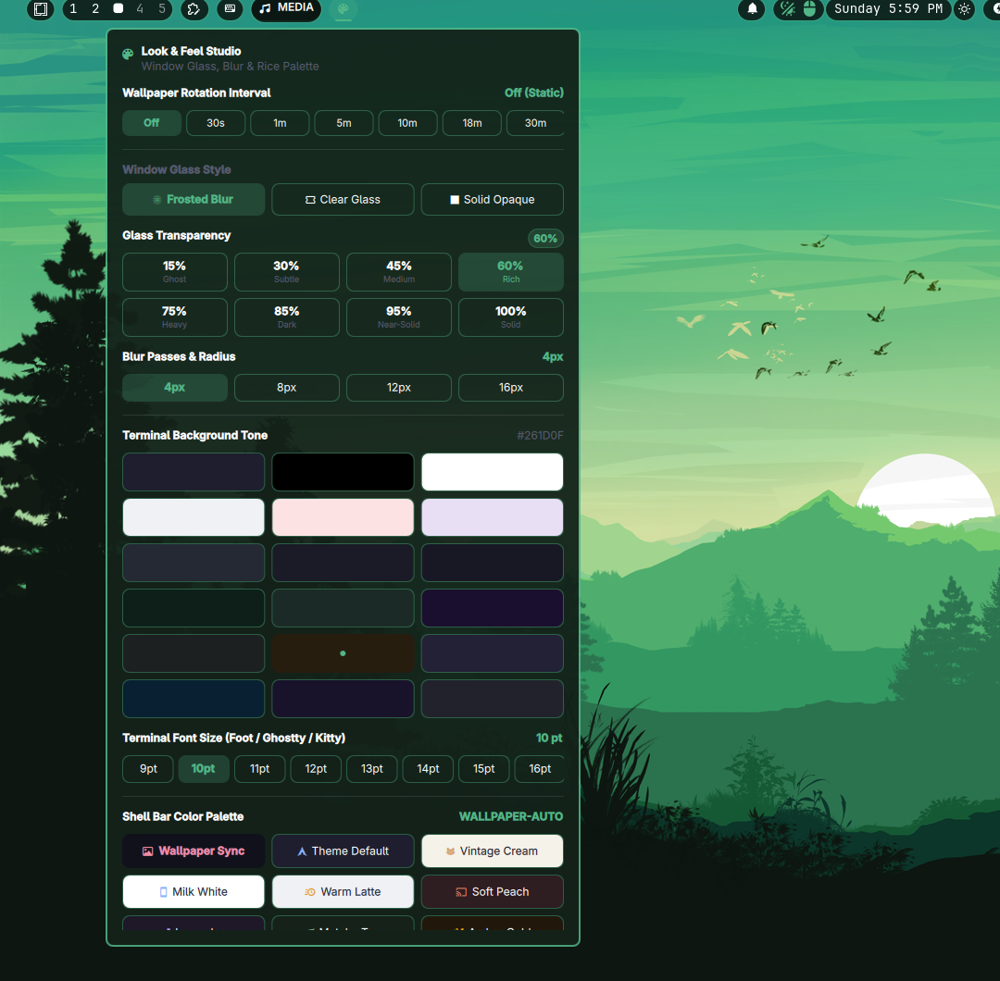

# Look & Feel Studio (`bohar.looknfeel_center`)

An interactive visual customization studio and status bar widget for **Omarchy Linux**. 
Provides live window glass opacity, frosted blur controls, dynamic island bar transparency presets, live terminal typography scaling, wallpaper interval rotation, and curated color theme swatches.



---

## 🎨 Features

* **Glass Opacity Cards:** 8 responsive stepped opacity presets (`15% Ghost` to `100% Solid`).
* **Frosted Window Blur:** Live blur radius controls (`4px Subtle`, `8px Balanced`, `12px Heavy`, `16px Deep`) applied directly to Hyprland compositor.
* **Bar Island Transparency:** Dynamic glass presets (`Full Glass`, `Ultra Glass`, `Translucent`, `Semi Glass`, `Frosted`, `Solid Bar`).
* **Live Terminal Font Scaler:** Dynamically resizes and live-reloads fonts across **Ghostty**, **Foot**, **Kitty**, and **Alacritty** without restarting terminals.
* **Wallpaper Rotation Interval:** One-tap rotation interval selector (`Off`, `30s`, `1m`, `5m`, `10m`, `18m`, `30m`).
* **Curated Color Swatches:** 24 built-in theme tones (Catppuccin Mocha, Tokyo Night, Nord Dark Polar, Gruvbox, Rosé Pine, OLED Black, etc.).
* **100% Self-Contained:** Bundles all helper tools inside `scripts/` with relative PATH resolution. Zero external dependencies required.

---

## 📦 Installation

Install directly with the official Omarchy CLI:

```bash
omarchy plugin add https://github.com/bhjhmkpk-commits/bohar.looknfeel_center.git --enable
```

### Manual Installation
```bash
git clone https://github.com/bhjhmkpk-commits/bohar.looknfeel_center.git ~/.config/omarchy/plugins/bohar.looknfeel_center
omarchy restart shell
omarchy plugin enable bohar.looknfeel_center
```

---

## ⌨️ CLI / IPC Control

Open or toggle the Look & Feel Studio from keybindings or scripts:

```bash
# Toggle the Look & Feel Studio popup drawer
omarchy-shell bohar.looknfeel_center toggle

# Direct control via bundled helper script
~/.config/omarchy/plugins/bohar.looknfeel_center/scripts/omarchy-blur-opacity set-mode blur
~/.config/omarchy/plugins/bohar.looknfeel_center/scripts/omarchy-blur-opacity set-bg-opacity 0.60
~/.config/omarchy/plugins/bohar.looknfeel_center/scripts/custom-omarchy-terminal-font-size 12
```

---

## ⚙️ Compatibility

* **Compositor:** Hyprland 0.54+ / Wayland.
* **Shell Host:** Quickshell / Omarchy Shell.
* **Terminals Supported:** Ghostty, Foot, Kitty, Alacritty.
* **Safety:** Runs 100% in user space without modifying root or `/usr/share/omarchy/`.

---

## 📄 License

MIT License.
